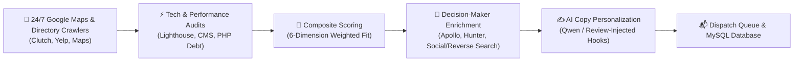

# ⚡Autonomous Lead Discovery & Intelligence Engine

Nexidant Signal is a high-throughput, automated B2B lead generation, technical stack intelligence, and personalized sales outreach engine. It continuously discovers high-ticket commercial prospects across **Google Maps, Yelp, Clutch, GoodFirms, and Job Boards**, executes deep technical audits (WordPress debt, PHP/Laravel versioning, Core Web Vitals, API vulnerabilities), extracts decision-maker emails, and pre-stages AI-personalized cold outreach.

---

## 🏗️ Architecture & Pipeline Flow



---

## 🌟 Key Features

1. **24/7 Continuous Google Maps Discovery Crawler**:
   - Systematically rotates across **25 high-value service verticals** and **60 top US metro markets** (1,500 combination matrix).
   - Exhaustive multi-page bottom pagination (`start=0, 20, 40...` up to Page 20) until the end of search results.
   - Persists state position to `gmaps_crawler_state.json` to survive VPS reboots without repeating past searches.

2. **Turnkey "No-Website" High-Priority Detection**:
   - Identifies active local businesses with verified phone numbers & Google reviews but no custom website.
   - Awards instant **92.0 Score (Immediate Tier 1 Priority)** with high-ticket website creation opportunities ($2,500 – $5,000 deal range).
   - Discovers real business inboxes via social media dorking (Facebook/Instagram business pages) and reverse directory lookups.

3. **Strict Zero-Duplicate Architecture**:
   - Dual-layer deduplication across in-memory **Redis ($O(1)$ lookup)** and **MySQL database constraints**.
   - Guarantees each company, domain, or synthetic `.local` hash is ingested and emailed only once.

4. **Review-Injected Cold Email Hooks**:
   - Automatically injects real Google Maps review counts & ratings into cold outreach copy for maximum reply conversion.

---

## 🚀 Quick Start & Installation

### Prerequisites
- Python 3.11+ or 3.12+
- Redis Server (`redis-server`)
- MySQL / MariaDB

### 1. Setup Virtual Environment
```bash
cd signal-engine
python3 -m venv venv
source venv/bin/activate
pip install -r requirements.txt
```

### 2. Configure Environment Variables
Copy `.env.example` (or configure `.env`):
```env
DB_HOST=127.0.0.1
DB_PORT=3306
DB_DATABASE=nexidant_signal
DB_USERNAME=your_user
DB_PASSWORD=your_password

REDIS_HOST=127.0.0.1
REDIS_PORT=6379

# Optional API Keys (for enhanced C-level enrichment)
APOLLO_API_KEY=your_apollo_key
HUNTER_API_KEY=your_hunter_key
```

### 3. Initialize Database Tables
```bash
python scripts/init_db.py
```

---

## 🛠️ CLI Runners & Background Daemons

### Run the 24/7 Google Maps Crawler (4-Hour Cycle)
```bash
python scripts/run_google_maps_crawler.py --daemon --cycle-hours 4.0 --queries 12
```

### Run the Master Daily Pipeline (One-Command End-to-End Execution)
```bash
./scripts/run_daily_pipeline.sh
```

### Clean Redundant/Duplicate Records
```bash
python scripts/clean_duplicate_outreach.py
```

### Run Individual Pipeline Stages
```bash
python scripts/run_discovery.py          # Crawls Clutch, GoodFirms, Yelp
python scripts/run_intelligence.py       # Scans Tech Stacks & PageSpeed Latency
python scripts/run_scoring.py            # Computes Weighted Fit & Deal Values
python scripts/run_enrichment.py         # Enriches Decision-Maker Emails
python scripts/run_offline_copy_batch.py # Generates Personalized AI Email Copy
```

---

## ⚙️ Running with Supervisor in aaPanel

To keep the 24/7 Google Maps Crawler running continuously in background:

1. Open **Supervisor Manager** in aaPanel.
2. Click **Add Daemon**:
   - **Name**: `nexidant-gmaps-crawler`
   - **Run Dir**: `/www/wwwroot/nexidant-signal/signal-engine`
   - **Start Command**: `/www/wwwroot/nexidant-signal/signal-engine/venv/bin/python scripts/run_google_maps_crawler.py --daemon --cycle-hours 4.0 --queries 12`
   - **Processes**: `1`
   - **Auto-restart**: Enabled

---

## 🧪 Running Automated Tests

```bash
pytest
```
*Current test suite: **47 / 47 unit tests passing**.*
